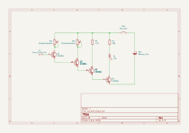
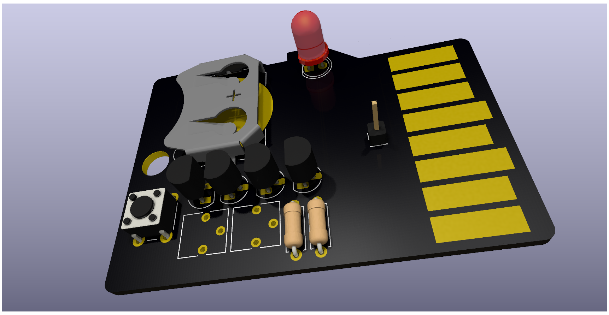

# SD EMF

A simple EMF detector built using discrete components with a SD Card shaped PCB.

## Schematic

## PCB

## BOM
| Part | Quantity |
| --- | --- |
| Battery Holder | 1 |
| LED | 1 |
| 2N3904 Transistor | 3 |
| Resistor 220 Ohm | 1 |
| Resistor 4.7k Ohm | 1 |
| Potentiometer | 2 |
| Push Button | 1 |

## License
This project is licensed under the [AGPL-3.0 License](LICENSE).

## Author
Made by [Arnav Kumar](https://github.com/arnav-kr) | Slack (`@ak`)